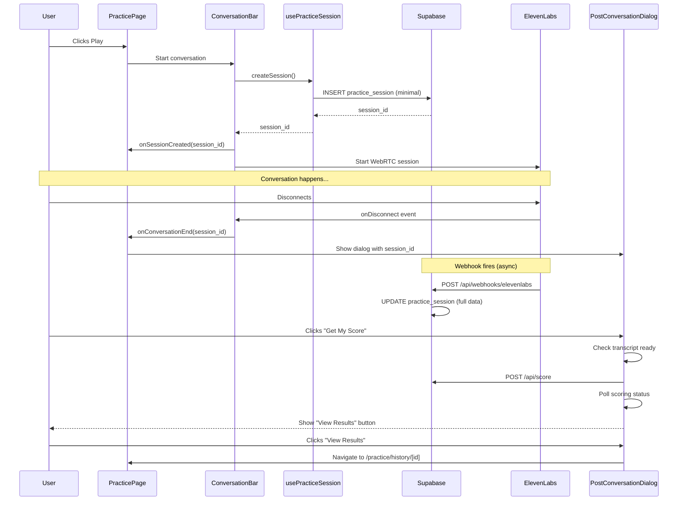

# Scoring UX Implementation - Complete ✅

## Summary

Successfully implemented the post-conversation scoring UX flow with alert dialog, client-side session tracking, and dedicated session details page.

## What Was Implemented

### 1. ✅ Session Management Hook
**File**: `hooks/use-practice-session.ts`

- Creates practice_session records client-side when conversations start
- Prevents race conditions with webhook-based session creation
- Provides session_id immediately for scoring workflow

### 2. ✅ Post-Conversation Alert Dialog
**File**: `components/practice/post-conversation-dialog.tsx`

Features:
- Shows automatically when ElevenLabs conversation disconnects
- Three action buttons:
  - **Get My Score**: Triggers scoring workflow with loading states
  - **Start Over**: Refreshes the page to start a new session
  - **Go Back Home**: Navigates to /home
- Handles multiple states:
  - `idle`: Initial state with three options
  - `waiting_transcript`: Polls until transcript is ready
  - `scoring`: Shows spinner while AI evaluates
  - `scored`: Shows "View Results" button
  - `error`: Shows error with retry option
- Polls for transcript completion (max 30 seconds)
- Polls for scoring completion (2-second intervals)

### 3. ✅ Updated ConversationBar Component
**File**: `components/elevenlabs/conversation-bar.tsx`

New features:
- Integrates `usePracticeSession` hook
- Creates session on conversation start
- New props:
  - `onSessionCreated`: Callback with session_id
  - `onConversationEnd`: Fires on disconnect with session_id
  - `userId`, `characterId`, `characterName`, `activityId`: For session tracking
- Clears session state on disconnect

### 4. ✅ Updated Practice Page
**File**: `app/(app)/practice/page.tsx`

Changes:
- Tracks current session_id in state
- Shows `PostConversationDialog` on disconnect
- Passes session tracking props to ConversationBar
- Handles conversation end callback

### 5. ✅ Session Details Page
**File**: `app/(app)/practice/history/[id]/page.tsx`

Features:
- Server component with RLS checks
- Displays session metadata (character, duration, date)
- Shows scorecard if available
- Renders full transcript with chat-style UI
- "Back to History" navigation

### 6. ✅ Scoring Status API
**File**: `app/api/score/status/route.ts`

GET endpoint:
- Accepts `session_id` query parameter
- Returns scoring status, scorecard_id, and transcript availability
- Used by dialog for polling

### 7. ✅ ElevenLabs Webhook Handler
**File**: `app/api/webhooks/elevenlabs/route.ts`

Features:
- Receives webhooks from ElevenLabs when conversations end
- Finds existing practice_session by conversation_id or recent agent_id
- Updates session with full call data, transcript, and metadata
- Handles cases where session doesn't exist
- Ready for automatic scoring trigger (commented out)

## Architecture Flow



## Next Steps - Configuration Required

### ⚠️ IMPORTANT: Configure ElevenLabs Webhook

You need to update the ElevenLabs webhook destination in your ElevenLabs dashboard:

1. **Navigate to**: ElevenLabs Dashboard → Agent Settings → Webhooks
2. **Update webhook URL from Make.com to**:
   ```
   https://typeform-app-1.vercel.app/api/webhooks/elevenlabs
   ```
3. **Ensure webhook events include**: `conversation.ended` (or equivalent)
4. **Test**: Start a conversation and verify webhook delivery in Vercel logs

### Benefits of Direct Webhook Integration

- ✅ Eliminates external dependency on Make.com
- ✅ Reduces latency in session updates
- ✅ Improves reliability and debugging
- ✅ Enables future automatic scoring triggers

## Testing Checklist

- [ ] Start conversation → verify session created in database
- [ ] Disconnect → verify alert dialog appears with three buttons
- [ ] Click "Start Over" → verify page reloads
- [ ] Click "Go Back Home" → verify navigation to /home
- [ ] Click "Get My Score" → verify spinner shows
- [ ] Wait for scoring → verify "View Results" button appears
- [ ] Click "View Results" → verify navigation to /practice/history/[id]
- [ ] Details page shows full transcript and scorecard
- [ ] Webhook updates session with full data after call ends
- [ ] Test direct ElevenLabs webhook delivery

## Files Created

1. `hooks/use-practice-session.ts` - Session management hook
2. `components/practice/post-conversation-dialog.tsx` - Alert dialog component
3. `app/api/score/status/route.ts` - Status polling API
4. `app/(app)/practice/history/[id]/page.tsx` - Session details page

## Files Modified

1. `components/elevenlabs/conversation-bar.tsx` - Added session tracking
2. `app/(app)/practice/page.tsx` - Integrated dialog and callbacks
3. `app/api/webhooks/elevenlabs/route.ts` - Implemented webhook handling

## Edge Cases Handled

✅ **Transcript not ready**: Dialog waits up to 30 seconds with polling
✅ **Scoring fails**: Error state with retry button
✅ **User closes dialog**: Session saved, can score later from history
✅ **No session found**: Webhook logs warning but doesn't fail
✅ **Multiple recent sessions**: Finds most recent by timestamp

## Future Enhancements (Optional)

1. **Automatic Scoring**: Uncomment the scoring trigger in webhook handler
2. **Real-time Updates**: Use Supabase realtime subscriptions for status
3. **Audio Playback**: Add audio player to session details page
4. **Batch Scoring**: Score multiple sessions at once from history page
5. **Export Transcripts**: Download as PDF or text file

## Troubleshooting

### Dialog doesn't appear after disconnect
- Check browser console for errors
- Verify `onConversationEnd` callback is firing
- Ensure `userId` is passed to ConversationBar

### "No transcript" error when scoring
- Wait longer (webhook may be delayed)
- Check Vercel logs for webhook delivery
- Verify ElevenLabs webhook is configured correctly

### Session not found in database
- Check that `userId` is available when starting conversation
- Verify Supabase RLS policies allow INSERT on practice_sessions
- Check browser console for session creation errors

### Webhook not updating session
- Verify webhook URL is correct in ElevenLabs dashboard
- Check Vercel function logs for webhook errors
- Ensure conversation_id or agent_id matches

---

**Implementation Complete!** 🎉

All features are implemented and ready for testing. The only remaining step is to configure the ElevenLabs webhook destination as described above.


