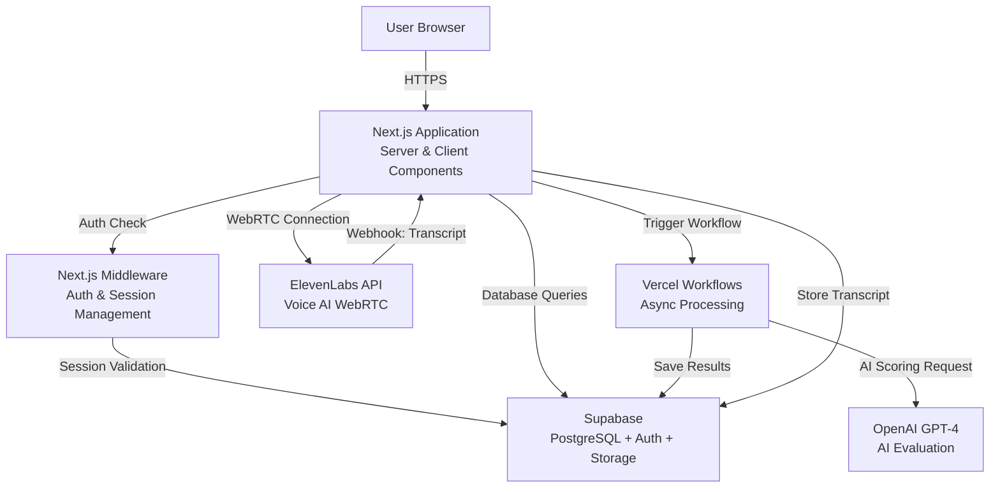
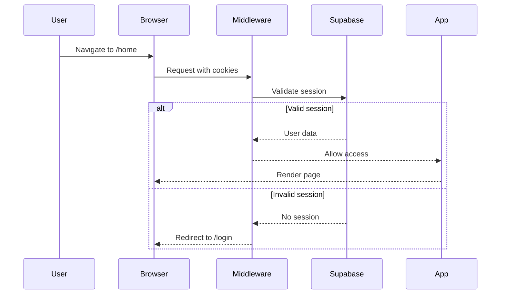
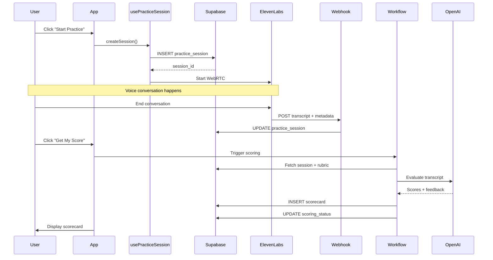
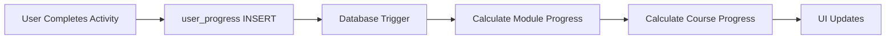

# System Architecture

This document provides a comprehensive overview of the NBG Coaching Practice Platform's architecture, design decisions, and technical implementation.

## Table of Contents

- [High-Level Overview](#high-level-overview)
- [Architecture Diagram](#architecture-diagram)
- [Tech Stack](#tech-stack)
- [Application Structure](#application-structure)
- [Database Schema](#database-schema)
- [Authentication & Authorization](#authentication--authorization)
- [Key Integrations](#key-integrations)
- [Data Flows](#data-flows)
- [Context Providers](#context-providers)
- [Server vs Client Components](#server-vs-client-components)
- [Design Patterns](#design-patterns)

## High-Level Overview

The NBG Coaching Practice Platform is a full-stack web application built with Next.js 16 (App Router) and React 19. It enables coaches to practice conversations with AI characters, complete learning activities, and receive AI-powered feedback.

**Core Architecture:**
- **Frontend**: Next.js with React (Server & Client Components)
- **Backend**: Supabase (PostgreSQL, Auth, Storage, Realtime)
- **AI Processing**: Vercel Workflows with OpenAI GPT-4
- **Voice AI**: ElevenLabs Conversational AI (WebRTC)

## Architecture Diagram



## Tech Stack

### Frontend Layer

**Next.js 16 (App Router)**
- React 19 framework with server-side rendering
- App Router for file-based routing
- Server Components for data fetching
- Client Components for interactivity
- API Routes for backend endpoints

**React 19**
- Modern React with concurrent features
- Hooks for state management
- Context API for global state

**TypeScript**
- Full type safety across the codebase
- Generated types from Supabase schema
- Zod schemas for runtime validation

**Styling & UI**
- **Tailwind CSS 4** - Utility-first CSS framework
- **Radix UI** - Accessible component primitives
- **Framer Motion** - Animation library
- **Lucide React** - Icon library

### Backend Layer

**Supabase**
- **PostgreSQL 17** - Relational database
- **Supabase Auth** - Authentication & user management
- **Supabase Storage** - File storage (images, videos)
- **Supabase Realtime** - Real-time subscriptions (optional)
- **Row Level Security (RLS)** - Data access control

**Next.js API Routes**
- RESTful API endpoints
- Webhook handlers
- Server-side business logic

**Vercel Workflows**
- Async task processing
- Multi-step AI scoring workflow
- Durable execution with retries

### AI & Integrations

**OpenAI**
- **GPT-4** - AI-powered conversation evaluation
- **AI SDK** - Vercel's AI SDK for structured outputs
- Rubric-based scoring with criteria breakdown

**ElevenLabs**
- **Conversational AI** - Voice-based AI characters
- **WebRTC** - Real-time audio streaming
- **Webhooks** - Post-conversation data delivery

**Typeform**
- Embedded assessments and quizzes
- Response collection and processing

### Development Tools

- **Supabase CLI** - Local development and migrations
- **ESLint** - Code linting
- **PostCSS** - CSS processing
- **Git** - Version control

## Application Structure

```
typeform-app-1/
├── app/                          # Next.js App Router
│   ├── (app)/                    # Protected routes (requires auth)
│   │   ├── layout.tsx            # Protected layout with auth check
│   │   ├── home/                 # Dashboard
│   │   ├── practice/             # Practice sessions
│   │   │   ├── page.tsx          # Main practice page
│   │   │   └── history/          # Session history
│   │   │       ├── page.tsx      # History list
│   │   │       └── [id]/         # Individual session
│   │   ├── learn/                # Learning activities
│   │   ├── activity/             # Activity pages
│   │   │   ├── roleplay/[id]/    # Roleplay activities
│   │   │   └── typeform/[id]/    # Typeform activities
│   │   └── settings/             # User settings
│   ├── (auth)/                   # Auth routes (public)
│   │   ├── layout.tsx            # Auth layout
│   │   ├── login/                # Login page
│   │   ├── sign-up/              # Sign up page
│   │   ├── forgot-password/      # Password reset
│   │   └── update-password/      # Password update
│   ├── admin/                    # Admin routes
│   │   ├── layout.tsx            # Admin layout with auth check
│   │   ├── manage/               # Content management
│   │   └── characters/           # Character management
│   ├── api/                      # API routes
│   │   ├── score/                # Scoring endpoints
│   │   │   ├── route.ts          # POST: Trigger scoring
│   │   │   └── status/           # GET: Check status
│   │   └── webhooks/             # Webhook handlers
│   │       └── elevenlabs/       # ElevenLabs webhook
│   ├── layout.tsx                # Root layout
│   ├── page.tsx                  # Landing page
│   └── globals.css               # Global styles
├── components/                   # React components
│   ├── practice/                 # Practice-related components
│   │   ├── score-session-button.tsx
│   │   ├── scorecard-display.tsx
│   │   └── post-conversation-dialog.tsx
│   ├── elevenlabs/               # ElevenLabs integration
│   │   └── conversation-bar.tsx  # Voice conversation UI
│   ├── onboarding/               # Onboarding system
│   ├── tw-blocks/                # Tailwind blocks
│   └── ui/                       # Reusable UI components
├── lib/                          # Utilities and configuration
│   ├── actions/                  # Server actions
│   │   ├── course-actions.ts     # Course operations
│   │   ├── practice-actions.ts   # Practice operations
│   │   ├── typeform-actions.ts   # Typeform operations
│   │   └── user-actions.ts       # User operations
│   ├── context/                  # React context providers
│   │   ├── user-context.tsx      # User state
│   │   ├── character-context.tsx # Character state
│   │   ├── onboarding-context.tsx# Onboarding state
│   │   └── user-progress-context.tsx # Progress state
│   ├── schemas/                  # Zod validation schemas
│   │   └── scorecard.ts          # Scorecard schema
│   ├── supabase/                 # Supabase clients
│   │   ├── client.ts             # Client-side client
│   │   ├── server.ts             # Server-side client
│   │   ├── admin.ts              # Admin client (service role)
│   │   ├── middleware.ts         # Middleware client
│   │   └── types.ts              # Generated database types
│   ├── utils/                    # Helper functions
│   │   └── roleplay.ts           # Roleplay utilities
│   ├── constants.ts              # App constants
│   └── utils.ts                  # General utilities
├── hooks/                        # Custom React hooks
│   ├── use-mobile.ts             # Mobile detection
│   ├── use-media-query.ts        # Media query hook
│   ├── use-practice-session.ts   # Session management
│   └── use-supabase-upload.ts    # File upload
├── workflows/                    # Vercel Workflows
│   └── score/                    # AI scoring workflow
│       └── workflow.ts           # Multi-step scoring logic
├── supabase/                     # Supabase configuration
│   ├── config.toml               # Local dev config
│   └── migrations/               # Database migrations
│       └── 20260102000000_add_scorecard_system.sql
└── public/                       # Static assets
    ├── llms.txt                  # AI context file
    └── *.png                     # Images
```

## Database Schema

### Core Tables

**users** (Supabase Auth)
- Managed by Supabase Auth
- Extended with custom fields via triggers
- Linked to all user-specific data

**activities**
- Defines learning activities (roleplay, typeform)
- Links to characters for roleplay activities
- Contains rubric prompts for scoring
- Organized by difficulty and loop type

**characters**
- AI character profiles for roleplay
- JSONB fields for personality attributes
- Communication styles, scenarios, phrases
- Difficulty ratings (1-5)

**practice_sessions**
- Records of voice conversations
- Stores transcripts (JSONB array)
- Links to users, activities, characters
- Tracks scoring status

**scorecards**
- AI evaluation results
- Overall score (0-100)
- Criteria-by-criteria breakdown (JSONB)
- Constructive feedback text
- Links to sessions, users, activities

### Curriculum Tables

**courses**
- Top-level learning containers
- Title, description, order

**modules**
- Belong to courses
- Contain multiple topics
- Ordered within courses

**topics**
- Belong to modules
- Contain multiple activities
- Ordered within modules

**activities** (already described above)
- Belong to topics
- Can be roleplay or typeform
- Ordered within topics

### Progress Tracking Tables

**user_progress**
- Tracks activity completion
- User + Activity relationship
- Completion timestamps

**module_progress**
- Tracks module completion
- Auto-calculated via triggers
- Completion percentage

**course_progress**
- Tracks course completion
- Auto-calculated via triggers
- Completion percentage

### Supporting Tables

**prompts**
- Stores reusable prompt templates
- Used for scoring rubrics
- Label-based lookup

**user_onboarding**
- Tracks onboarding step completion
- Per-user, per-step status
- Dismissal tracking

### Database Views

**curriculum_hierarchy**
- Joins courses → modules → topics → activities
- Provides complete curriculum structure
- Used for navigation and progress

**activity_summaries**
- Aggregates activity information
- Includes character details
- Used for activity listings

**scorecards_with_activity**
- Joins scorecards with activity details
- Simplifies scorecard queries
- Includes character information

**onboarding_analytics**
- Aggregates onboarding completion rates
- Per-step statistics
- Used for admin dashboard

### Key Database Features

**Row Level Security (RLS)**
- All tables have RLS policies
- Users can only access their own data
- Admin role for management operations

**Triggers**
- Auto-update timestamps (`updated_at`)
- Auto-calculate progress on completion
- Sync activity responses to progress

**Functions**
- `initialize_course_progress` - Set up progress tracking
- `process_typeform_response` - Handle Typeform submissions
- `sync_activity_responses_to_progress` - Update progress
- `update_progress_on_completion` - Recalculate completion

## Authentication & Authorization

### Authentication Flow



### Middleware (`lib/supabase/middleware.ts`)

- Runs on every request
- Validates Supabase session
- Refreshes expired tokens
- Redirects unauthenticated users

### Protected Routes

**Route Groups:**
- `(app)/*` - Requires authentication
- `(auth)/*` - Public (login, signup)
- `admin/*` - Requires admin role

**Layout-based Protection:**
- Each route group has a layout that checks auth
- Server Components verify session server-side
- Client Components use UserContext

### Authorization Levels

1. **Public** - No auth required (landing page)
2. **Authenticated** - Any logged-in user (app routes)
3. **Admin** - Admin role required (admin routes)

### Row Level Security (RLS)

**Policies enforce:**
- Users can only read/write their own data
- Admin users can access all data
- Service role bypasses RLS (for workflows)

**Example Policy:**
```sql
-- Users can only see their own practice sessions
CREATE POLICY "Users can view own sessions"
ON practice_sessions FOR SELECT
USING (auth.uid() = user_id);
```

## Key Integrations

### ElevenLabs Integration

**Purpose**: Real-time voice conversations with AI characters

**Flow:**
1. User clicks "Start Conversation"
2. Client establishes WebRTC connection
3. Audio streams bidirectionally
4. Conversation transcript builds in real-time
5. On disconnect, webhook delivers full transcript

**Components:**
- `components/elevenlabs/conversation-bar.tsx` - UI component
- `hooks/use-practice-session.ts` - Session management
- `app/api/webhooks/elevenlabs/route.ts` - Webhook handler

**Configuration:**
- Agent ID stored in `NEXT_PUBLIC_ELEVENLABS_AGENT_ID`
- Webhook URL: `https://your-domain.com/api/webhooks/elevenlabs`

### OpenAI Integration

**Purpose**: AI-powered conversation evaluation

**Flow:**
1. User requests scoring
2. Workflow fetches session + rubric
3. OpenAI evaluates transcript
4. Structured output with scores + feedback
5. Results saved to database

**Implementation:**
- `workflows/score/workflow.ts` - Multi-step workflow
- Uses `generateObject` from AI SDK
- GPT-4 model for high-quality evaluation
- Zod schema for structured output

**Configuration:**
- API key stored in `OPENAI_API_KEY`
- Model: `gpt-5.2` (latest GPT-4)

### Typeform Integration

**Purpose**: Embedded assessments and quizzes

**Implementation:**
- `@typeform/embed-react` package
- Embedded in activity pages
- Responses processed via webhooks (optional)

**Configuration:**
- Form IDs stored in activities table
- Embedded using PopupButton or Widget

## Data Flows

### Practice Session Flow



### Scoring Workflow Steps

**Step 1: Fetch Practice Session**
- Query `practice_sessions` table
- Retrieve transcript and metadata
- Update status to "scoring"

**Step 2: Fetch Rubric**
- Query `prompts` table for rubric
- Label: `scorecard_rubric`
- Contains evaluation criteria

**Step 3: AI Evaluation**
- Send transcript + rubric to OpenAI
- Use structured output (Zod schema)
- Get scores, criteria breakdown, feedback

**Step 4: Save Results**
- Insert scorecard record
- Update session status to "scored"
- Return results

### Progress Tracking Flow



## Context Providers

### UserContext (`lib/context/user-context.tsx`)

**Purpose**: Global user state management

**Provides:**
- Current user data
- Loading state
- Refresh function

**Usage:**
```typescript
const { user, loading, refreshUser } = useUser();
```

### CharacterContext (`lib/context/character-context.tsx`)

**Purpose**: Character selection and state

**Provides:**
- Selected character
- Character list
- Selection function

### OnboardingContext (`lib/context/onboarding-context.tsx`)

**Purpose**: Onboarding step tracking

**Provides:**
- Step completion status
- Mark completed/dismissed
- Reset functionality

### UserProgressContext (`lib/context/user-progress-context.tsx`)

**Purpose**: User progress tracking

**Provides:**
- Course progress
- Module progress
- Activity completion status

## Server vs Client Components

### Server Components (Default)

**Used for:**
- Data fetching
- Database queries
- Static content
- SEO-critical pages

**Examples:**
- `app/(app)/home/page.tsx` - Fetches user stats
- `app/(app)/practice/history/page.tsx` - Lists sessions
- `app/(app)/learn/page.tsx` - Shows curriculum

**Benefits:**
- No JavaScript sent to client
- Direct database access
- Better performance

### Client Components

**Used for:**
- Interactivity
- State management
- Browser APIs
- Real-time updates

**Examples:**
- `components/elevenlabs/conversation-bar.tsx` - WebRTC
- `components/practice/score-session-button.tsx` - Button state
- `components/practice/post-conversation-dialog.tsx` - Dialog

**Marked with:**
```typescript
'use client'
```

## Design Patterns

### Server Actions

**Pattern**: Server-side mutations from client components

**Location**: `lib/actions/*.ts`

**Example:**
```typescript
'use server'

export async function createPracticeSession(data) {
  const supabase = createServerClient();
  const { data: session } = await supabase
    .from('practice_sessions')
    .insert(data)
    .select()
    .single();
  return session;
}
```

### Custom Hooks

**Pattern**: Reusable logic extraction

**Location**: `hooks/*.ts`

**Example:**
```typescript
export function usePracticeSession() {
  const [sessionId, setSessionId] = useState(null);
  
  const createSession = async (data) => {
    // Create session logic
  };
  
  return { sessionId, createSession };
}
```

### Type Safety

**Pattern**: End-to-end type safety

**Implementation:**
- Database types generated from Supabase schema
- Zod schemas for runtime validation
- TypeScript for compile-time checking

**Example:**
```typescript
import { Database } from '@/lib/supabase/types';
import { scorecardOutputSchema } from '@/lib/schemas/scorecard';

type PracticeSession = Database['public']['Tables']['practice_sessions']['Row'];
```

### Error Handling

**Pattern**: Graceful error handling with user feedback

**Implementation:**
- Try-catch blocks in server actions
- Toast notifications for user feedback
- Error boundaries for component errors
- Fallback UI for failed data fetching

---

**Next Steps:**
- [Features Documentation](FEATURES.md) - Learn about specific features
- [API Reference](API.md) - Explore API endpoints
- [Deployment Guide](DEPLOYMENT.md) - Deploy to production
