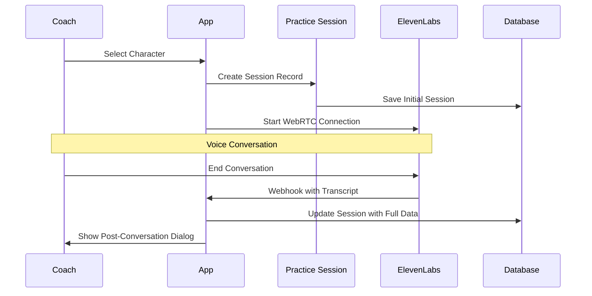
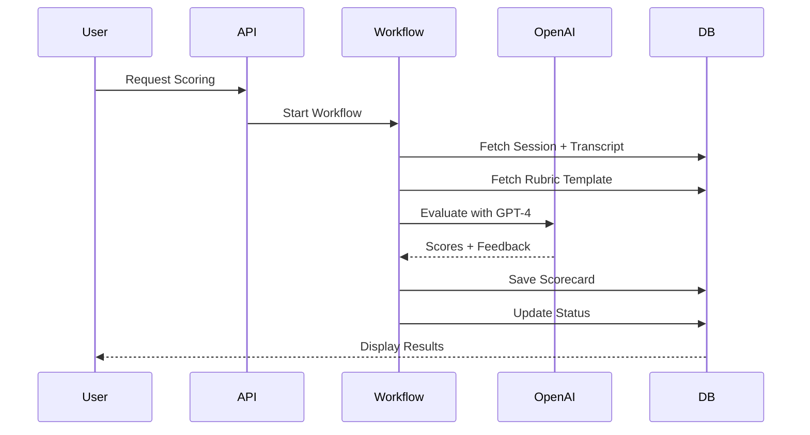

# Features Documentation

Comprehensive guide to all features in the NBG Coaching Practice Platform.

## Table of Contents

- [Overview](#overview)
- [Practice Sessions](#practice-sessions)
- [AI Scoring System](#ai-scoring-system)
- [Learning Activities](#learning-activities)
- [User Progress Tracking](#user-progress-tracking)
- [Character Management](#character-management)
- [Onboarding System](#onboarding-system)
- [Admin Features](#admin-features)

## Overview

The NBG Coaching Practice Platform provides a comprehensive suite of features for coaching practice and skill development:

- **Practice Sessions**: Voice conversations with AI characters
- **AI Scoring**: Automated evaluation with detailed feedback
- **Learning Activities**: Structured curriculum with courses and modules
- **Progress Tracking**: Monitor improvement over time
- **Character Management**: Rich AI character personas
- **Onboarding**: Guided introduction to platform features
- **Admin Tools**: Content and user management

## Practice Sessions

### Overview

Practice sessions allow coaches to have realistic voice conversations with AI characters to practice their coaching skills in a safe environment.

### How It Works



### Features

**Character Selection**
- Browse available characters
- View character profiles and difficulty ratings
- Filter by difficulty level
- See character images and descriptions

**Voice Conversations**
- Real-time audio streaming via WebRTC
- Bidirectional communication
- Low latency (< 500ms)
- High-quality audio
- Visual feedback during conversation

**Session Recording**
- Automatic transcript generation
- Message-by-message recording
- Timestamps for each message
- Speaker identification (user vs agent)

**Post-Conversation Flow**
- Automatic dialog after conversation ends
- Three options:
  - **Get My Score**: Trigger AI evaluation
  - **Start Over**: Begin new session
  - **Go Back Home**: Return to dashboard

### User Interface

**Practice Page** (`/practice`)
- Character grid with images and names
- Difficulty indicators
- Character descriptions
- Play button to start conversation

**Conversation UI**
- Large play/stop button
- Visual waveform during conversation
- Connection status indicator
- End conversation button

**Post-Conversation Dialog**
- Modal dialog with three action buttons
- Loading states during scoring
- Progress indicators
- Error handling with retry option

### Technical Implementation

**Client-Side Session Creation**
```typescript
// hooks/use-practice-session.ts
const createSession = async (data) => {
  const supabase = createClient();
  const { data: session } = await supabase
    .from('practice_sessions')
    .insert({
      user_id: data.userId,
      character_id: data.characterId,
      activity_id: data.activityId,
      agent_id: data.agentId,
      character_name: data.characterName,
    })
    .select()
    .single();
  
  return session;
};
```

**ElevenLabs Integration**
```typescript
// components/elevenlabs/conversation-bar.tsx
<Conversation
  agentId={agentId}
  onConnect={() => createSession()}
  onDisconnect={(conversationId) => handleEnd(conversationId)}
/>
```

**Webhook Processing**
- Receives full transcript and metadata
- Updates session with complete data
- Enables scoring functionality

### Session History

**History Page** (`/practice/history`)
- List of all past sessions
- Sortable by date
- Filterable by character
- Shows session duration
- Displays scoring status
- Links to detailed view

**Session Details** (`/practice/history/[id]`)
- Full transcript display
- Session metadata (date, duration, character)
- Scorecard display (if scored)
- Chat-style UI for transcript
- Back to history button

### Data Model

**practice_sessions Table**
```sql
- id: uuid (primary key)
- user_id: uuid (foreign key)
- character_id: uuid (foreign key)
- activity_id: uuid (nullable)
- conversation_id: text (ElevenLabs ID)
- agent_id: text (ElevenLabs agent)
- transcript: jsonb (array of messages)
- scoring_status: text (null | scoring | scored | failed)
- call_duration_secs: integer
- created_at: timestamptz
- updated_at: timestamptz
```

---

## AI Scoring System

### Overview

The AI Scoring System provides automated evaluation of practice sessions using OpenAI GPT-4 and rubric-based criteria.

**For complete implementation details, see:** [SCORECARD_IMPLEMENTATION.md](../SCORECARD_IMPLEMENTATION.md)

### How It Works



### Scoring Rubric

**Default Criteria (25 points each):**

1. **Empathy & Active Listening** (0-25 points)
   - Acknowledging feelings and emotions
   - Using reflective listening techniques
   - Demonstrating genuine understanding

2. **Powerful Questions** (0-25 points)
   - Asking open-ended questions
   - Helping clients gain insights
   - Demonstrating curiosity

3. **Goal Clarity & Action Planning** (0-25 points)
   - Establishing clear objectives
   - Identifying specific action steps
   - Securing commitment

4. **Communication & Presence** (0-25 points)
   - Clear, professional language
   - Appropriate pacing
   - Full engagement

**Overall Score**: Sum of all criteria (0-100)

### Rubric Configuration

Rubrics are stored in the `prompts` table:

```sql
SELECT * FROM prompts WHERE label = 'scorecard_rubric';
```

**Customizing the Rubric:**
```sql
UPDATE prompts
SET template = 'Your custom rubric here...'
WHERE label = 'scorecard_rubric';
```

### Scorecard Display

**Score Badge Colors:**
- 90-100%: "Excellent" (green)
- 75-89%: "Good" (blue)
- 60-74%: "Satisfactory" (gray)
- 0-59%: "Needs Work" (red)

**Components:**
- Overall score with percentage
- Progress bar visualization
- Constructive feedback text
- Criteria breakdown (collapsible)
- Individual criterion scores
- Rationale for each score

### User Interface

**Score Button** (`components/practice/score-session-button.tsx`)
- Shows in practice history
- Multiple states:
  - Default: "Score Conversation"
  - Loading: "Starting..."
  - Scoring: "Scoring..." (disabled)
  - Failed: "Retry Scoring"
  - Hidden: (when scorecard exists)

**Scorecard Display** (`components/practice/scorecard-display.tsx`)
- Inline display in history
- Expandable criteria section
- Visual progress bars
- Responsive design

### Workflow Implementation

**File**: `workflows/score/workflow.ts`

**Steps:**
1. **Fetch Practice Session** - Get transcript and metadata
2. **Fetch Rubric** - Get evaluation criteria
3. **AI Evaluation** - Send to OpenAI GPT-4
4. **Save Results** - Store scorecard and update status

**Execution Time**: 5-15 seconds

**Error Handling**:
- Retries on transient failures
- Updates status to "failed" on permanent errors
- Logs errors for debugging

### Data Model

**scorecards Table**
```sql
- id: uuid (primary key)
- session_id: uuid (foreign key)
- user_id: uuid (foreign key)
- activity_id: uuid (nullable)
- overall_score: integer (0-100)
- criteria_scores: jsonb (array of criteria)
- feedback: text
- created_at: timestamptz
- updated_at: timestamptz
```

**Criteria Score Format**:
```json
[
  {
    "name": "Empathy & Active Listening",
    "score": 22,
    "max_score": 25,
    "rationale": "Demonstrated good listening skills..."
  }
]
```

---

## Learning Activities

### Overview

The Learning Activities system provides a structured curriculum with courses, modules, topics, and activities.

### Curriculum Hierarchy

```
Courses
  └── Modules
      └── Topics
          └── Activities
              ├── Typeform (quizzes/assessments)
              └── Roleplay (practice conversations)
```

### Course Structure

**Courses** (`/learn`)
- Top-level learning containers
- Multiple modules per course
- Progress tracking
- Completion percentage

**Modules**
- Grouped topics within a course
- Sequential or flexible ordering
- Module-level progress

**Topics**
- Specific learning objectives
- Contains related activities
- Topic-level completion

**Activities**
- Individual learning tasks
- Two types: Typeform and Roleplay
- Difficulty levels: Fundamentals, Intermediate, Advanced
- Loop types: Introduce, Practice, Assess, Coming Soon

### Activity Types

#### Typeform Activities

**Purpose**: Assessments, quizzes, and surveys

**Implementation**:
- Embedded Typeform widgets
- Response collection
- Automatic completion tracking

**Page**: `/activity/typeform/[id]`

**Features**:
- Full-screen Typeform embed
- Automatic submission handling
- Progress updates on completion

#### Roleplay Activities

**Purpose**: Practice conversations with AI characters

**Implementation**:
- Links to practice page with character
- Character-specific scenarios
- Scoring after completion

**Page**: `/activity/roleplay/[id]`

**Features**:
- Character profile display
- Scenario description
- Start conversation button
- Links to practice history

### Activity Metadata

**Fields**:
- `activity_type`: "typeform" | "roleplay"
- `loop_type`: "introduce" | "practice" | "assess" | "coming soon"
- `difficulty`: "fundamentals" | "intermediate" | "advanced"
- `category`: Activity category
- `typeform_id`: Typeform form ID (for typeform activities)
- `character_id`: Character ID (for roleplay activities)
- `rubric_prompt`: Scoring rubric (for roleplay activities)

### User Interface

**Learn Page** (`/learn`)
- Course list with descriptions
- Module navigation
- Topic listings
- Activity cards with:
  - Activity type icon
  - Title and description
  - Difficulty badge
  - Loop type indicator
  - Completion status

**Activity Cards**
- Visual indicators for activity type
- Click to open activity
- Progress indicators
- Hover effects

### Data Model

**courses Table**
```sql
- id: uuid
- title: text
- description: text
- order: integer
```

**modules Table**
```sql
- id: uuid
- course_id: uuid
- title: text
- description: text
- order: integer
```

**topics Table**
```sql
- id: uuid
- module_id: uuid
- title: text
- description: text
- order: integer
```

**activities Table**
```sql
- id: uuid
- topic_id: uuid
- title: text
- description: text
- activity_type: text
- loop_type: text
- difficulty: text
- typeform_id: text (nullable)
- character_id: uuid (nullable)
- rubric_prompt: text (nullable)
- order: integer
```

---

## User Progress Tracking

### Overview

Automatic progress tracking across all learning activities with completion percentages and statistics.

### How It Works

**Automatic Updates via Database Triggers:**
1. User completes activity
2. `user_progress` record created
3. Trigger calculates module progress
4. Trigger calculates course progress
5. UI updates automatically

### Progress Levels

**Activity Progress** (`user_progress`)
- Binary: completed or not
- Timestamp of completion
- Links to specific activity

**Module Progress** (`module_progress`)
- Percentage: completed activities / total activities
- Auto-calculated via trigger
- Updates when any activity completes

**Course Progress** (`course_progress`)
- Percentage: completed modules / total modules
- Auto-calculated via trigger
- Updates when module completes

### Progress Display

**Home Dashboard** (`/home`)
- Total practice minutes
- Number of sessions
- Weekly/monthly statistics
- Recent activity feed
- Course progress overview

**Learn Page** (`/learn`)
- Course completion percentages
- Module progress bars
- Activity completion checkmarks
- Visual progress indicators

**Profile/Settings**
- Overall completion statistics
- Achievement tracking
- Learning streaks

### Data Model

**user_progress Table**
```sql
- id: uuid
- user_id: uuid
- activity_id: uuid
- completed: boolean
- completed_at: timestamptz
```

**module_progress Table**
```sql
- id: uuid
- user_id: uuid
- module_id: uuid
- completion_percentage: numeric
- completed_at: timestamptz (nullable)
```

**course_progress Table**
```sql
- id: uuid
- user_id: uuid
- course_id: uuid
- completion_percentage: numeric
- completed_at: timestamptz (nullable)
```

### Database Triggers

**Function**: `sync_activity_responses_to_progress`
- Triggered on activity completion
- Creates user_progress record
- Updates module_progress
- Updates course_progress

**Function**: `update_progress_on_completion`
- Recalculates completion percentages
- Marks modules/courses as complete
- Sets completion timestamps

---

## Character Management

### Overview

Rich AI character profiles with detailed personalities, communication styles, and scenarios.

### Character Profiles

**Core Fields**:
- Name
- Description
- Difficulty rating (1-5)
- Profile image
- Agent ID (ElevenLabs)

**JSONB Personality Attributes**:
- Communication styles (calm, anxious, defensive, vulnerable)
- Critical issues
- Relationship history
- Characteristic phrases
- Key topics
- Scenarios

### Character Attributes

**Communication Styles** (JSONB array):
```json
[
  {
    "style": "calm",
    "description": "Generally composed and thoughtful",
    "frequency": "common"
  },
  {
    "style": "anxious",
    "description": "Nervous when discussing certain topics",
    "frequency": "occasional"
  }
]
```

**Scenarios** (JSONB array):
```json
[
  {
    "title": "Career Transition",
    "description": "Considering a major career change",
    "difficulty": "intermediate",
    "key_topics": ["career", "goals", "fear"]
  }
]
```

### Character Selection

**Practice Page** (`/practice`)
- Grid layout with character cards
- Character images
- Names and difficulty ratings
- Click to start conversation

**Character Details**
- Full profile view
- Communication style indicators
- Scenario descriptions
- Difficulty explanation

### Admin Management

**Admin Characters Page** (`/admin/characters`)
- List all characters
- Create new characters
- Edit existing characters
- Upload character images
- Set difficulty ratings
- Configure personality attributes

### Data Model

**characters Table**
```sql
- id: uuid
- name: text
- description: text
- difficulty: integer (1-5)
- profile_image_url: text
- agent_id: text (ElevenLabs)
- communication_styles: jsonb
- critical_issues: jsonb
- relationship_history: jsonb
- characteristic_phrases: jsonb
- key_topics: jsonb
- scenarios: jsonb
```

---

## Onboarding System

### Overview

Database-backed onboarding system with step tracking, cross-device sync, and analytics.

**For complete documentation, see:** [components/onboarding/README.md](../components/onboarding/README.md)

### Features

- Step-by-step guided tours
- Dismissible dialogs and banners
- Cross-device synchronization
- Completion tracking
- Admin dashboard
- Analytics view

### Onboarding Steps

**Defined Steps**:
- `home_welcome` - Welcome to dashboard
- `home_features` - Feature overview
- `learn_first_visit` - Learning section intro
- `practice_first_visit` - Practice section intro
- `activity_roleplay_intro` - Roleplay explanation
- `activity_typeform_intro` - Assessment explanation
- `settings_theme` - Theme customization
- `settings_profile` - Profile settings

### Implementation

**OnboardingDialog Component**:
```typescript
<OnboardingDialog
  open={shouldShowStep("home_welcome")}
  onClose={(open) => !open && markDismissed("home_welcome")}
  title="Welcome!"
  description="Let's show you around"
  items={items}
  onContinue={() => markCompleted("home_welcome")}
/>
```

**useOnboarding Hook**:
```typescript
const {
  shouldShowStep,
  markCompleted,
  markDismissed,
  resetOnboarding
} = useOnboarding();
```

### Data Model

**user_onboarding Table**
```sql
- id: uuid
- user_id: uuid
- step: text
- completed: boolean
- dismissed: boolean
- completed_at: timestamptz
- dismissed_at: timestamptz
```

---

## Admin Features

### Overview

Administrative tools for content management and user administration.

### Admin Routes

**Admin Layout** (`/admin`)
- Requires admin role
- Sidebar navigation
- Protected routes

**Content Management** (`/admin/manage`)
- Create/edit courses
- Create/edit modules
- Create/edit topics
- Create/edit activities
- Manage curriculum structure

**Character Management** (`/admin/characters`)
- Create new characters
- Edit character profiles
- Upload character images
- Configure personality attributes
- Set difficulty ratings

### Access Control

**Admin Role Check**:
```typescript
const { data: user } = await supabase.auth.getUser();
const isAdmin = user?.user_metadata?.role === 'admin';

if (!isAdmin) {
  redirect('/home');
}
```

### Future Admin Features

- User management
- Analytics dashboard
- Content approval workflow
- Bulk operations
- Export/import tools

---

**Related Documentation:**
- [Architecture Overview](ARCHITECTURE.md) - System design
- [API Reference](API.md) - API endpoints
- [Setup Guide](SETUP.md) - Local development
- [Scorecard Implementation](../SCORECARD_IMPLEMENTATION.md) - Scoring details
- [Onboarding System](../components/onboarding/README.md) - Onboarding details
